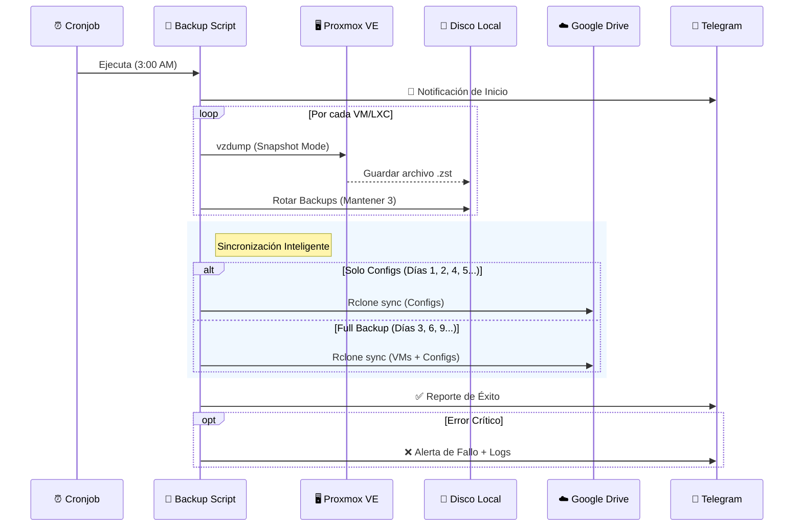

# 🔄 Proxmox Smart Backup

> **Sistema de respaldo híbrido e inteligente para Proxmox VE** — Backups automáticos locales, rotación inteligente y sincronización segura a Google Drive con notificaciones en tiempo real.

[](https://www.proxmox.com/)
[](https://www.gnu.org/software/bash/)
[](https://github.com/FiloSottile/age)
[](LICENSE)

<p align="center">
  
  <!-- Placeholder image, replace with actual screenshot/diagram if available -->
</p>

---

## ✨ Características

| Característica          | Descripción                                                                                             |
| :---------------------- | :------------------------------------------------------------------------------------------------------ |
| 💾 **Backup Local**      | Ejecución diaria de `vzdump` para VMs y Contenedores LXC con rotación configurable (Default: 3 copias). |
| ☁️ **Sync Híbrido**      | Estrategia inteligente: Configs se suben a diario, Backups pesados cada 3 días a Google Drive.          |
| 🔐 **Zero Knowledge**    | Gestión de secretos segura usando `age` para encriptar tokens y credenciales en el repositorio.         |
| 📱 **Alertas Real-Time** | Notificaciones detalladas por Telegram al iniciar, completar o fallar un respaldo.                      |
| 🤖 **Automatización**    | Instalador interactivo que configura Cronjobs, Logrotate y dependencias automáticamente.                |
| 📦 **Dependencias Auto** | Integración nativa con `dotfiles` para el manejo de `rclone` y credenciales de nube.                    |

---

## 🚀 Inicio Rápido

### Requisitos Previos

- **Proxmox VE** 7.x o superior.
- **Acceso Root** al servidor.
- **[dotfiles](https://github.com/herwingx/dotfiles)** ejecutado (Recomendado para instalar `age`, `rclone` y configurar `gdrive`).

### 1. Clonar el repositorio

```bash
cd /root/development
git clone https://github.com/herwingx/backup-proxmox.git
cd backup-proxmox
```

### 2. Configurar Secretos

Gestionamos las credenciales de forma segura. Copia la plantilla y configura tus tokens.

```bash
cp .env.example .env
nano .env
```

Variables principales (`.env`):
```env
TELEGRAM_TOKEN="123456789:ABCdefGHIjklMNOpqrsTUVwxyZ"
TELEGRAM_CHAT_ID="987654321"
```

Encripta tus secretos para mantenerlos seguros (opcional pero recomendado):
```bash
./scripts/manage_secrets.sh encrypt
# Te pedirá una passphrase. ¡Guárdala bien!
```

### 3. Instalación Automática

El script instalará las herramientas en `/usr/local/bin` y configurará el Cronjob.

```bash
sudo ./install.sh
```

El asistente verificará:
- [x] Dependencias (`age`, `rclone`).
- [x] Configuración de Google Drive (`rclone config`).
- [x] Desencriptado de secretos (si usaste `manage_secrets`).
- [x] Prueba de conexión con Telegram.

---

## 🏗️ Arquitectura

### 🗺️ Panorama General

El sistema sigue un flujo de respaldo híbrido priorizando la velocidad local y la seguridad en la nube.

```mermaid
graph TD
    subgraph Proxmox_Server [🖥️ Proxmox VE Server]
        style Proxmox_Server fill:#f9f9f9,stroke:#333,stroke-width:2px
        
        VMs[📦 VMs & LXC]
        VZDump[⚙️ VZDump Tool]
        LocalStore[📂 /mnt/backups/dump]
        Script[📜 Smart Backup Script]
        
        VMs -->|Snapshot Diario| VZDump
        VZDump -->|Genera .zst| LocalStore
        Script -.->|Controla| VZDump
    end

    subgraph Cloud [☁️ Nube]
        style Cloud fill:#e1f5fe,stroke:#0277bd,stroke-width:2px
        GDrive[Google Drive]
    end

    LocalStore -->|Sync Encriptado (rclone)| GDrive
    Script -->|Notificación| Telegram[📱 Telegram Bot]

    Note[📝 Estrategia de Subida:\n- Configs: Diario\n- VMs: Cada 3 Días]
    Script -.-> Note
```

### � Flujo de Ejecución

Detalle del proceso paso a paso ejecutado por el cronjob.



---

## 📦 Opciones de Despliegue

| Método         | Archivo Principal   | Uso Ideal                                                   |
| :------------- | :------------------ | :---------------------------------------------------------- |
| **Instalador** | `install.sh`        | **Producción**. Configura todo el entorno, logs y cronjobs. |
| **Manual**     | `scripts/backup.sh` | **Debug/Dev**. Ejecución directa para pruebas puntuales.    |

## 🔧 Comandos Útiles

```bash
# Ejecutar backup manualmente (Trigger inmediato)
proxmox-backup

# Ver logs en tiempo real
tail -f /var/log/proxmox-backup/backup-$(date +%F).log

# Editar configuración de entorno
nano /etc/proxmox-backup/config.env

# Gestionar secretos (Encriptar/Desencriptar)
./scripts/manage_secrets.sh help
```

## 📚 Documentación

| Documento                                                | Descripción                              |
| :------------------------------------------------------- | :--------------------------------------- |
| [`install.sh`](install.sh)                               | Script de instalación e idempotencia.    |
| [`scripts/backup.sh`](scripts/backup.sh)                 | Lógica principal de respaldo y rotación. |
| [`scripts/manage_secrets.sh`](scripts/manage_secrets.sh) | Utilidad para encriptar `.env` con age.  |

## 🛠️ Stack Tecnológico

**Core**
- **Bash**: Scripting avanzado con manejo de errores y señales.
- **Proxmox API / VZDump**: Herramientas nativas de virtualización.

**Seguridad & Almacenamiento**
- **Age**: Encriptación moderna para secretos.
- **Rclone**: Sincronización cloud agnóstica (Google Drive configurado por defecto).

**Notificaciones**
- **Telegram Bot API**: Alertas instantáneas.

## 🔒 Seguridad

- ✅ **Secretos Encriptados**: Las credenciales nunca se suben en texto plano al repositorio (uso de `.env.age`).
- ✅ **Permisos Restrictivos**: Los archivos de configuración en `/etc/proxmox-backup` tienen permisos `600` (solo root).
- ✅ **Logs Rotativos**: `logrotate` configurado para evitar saturación de disco, manteniendo 7 días de historial.

## 🤝 Contribuir

1. Fork del repositorio.
2. Crea una rama para tu feature: `git checkout -b feat/nueva-funcionalidad`.
3. Commit de tus cambios: `git commit -m 'feat: añade soporte para AWS S3'`.
4. Push a la rama: `git push origin feat/nueva-funcionalidad`.
5. Abre un Pull Request.

## 📄 Licencia

Este proyecto está bajo la licencia MIT. Ver [LICENSE](LICENSE) para más detalles.
