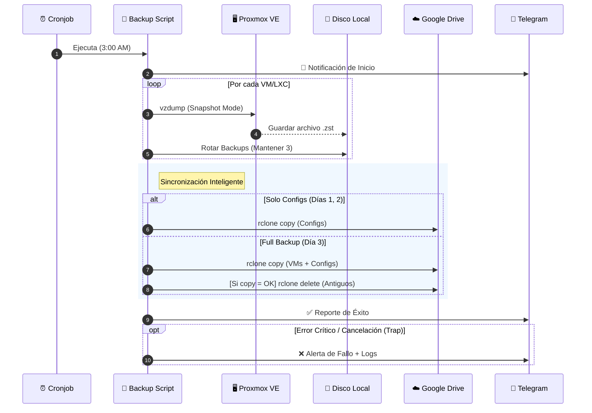

# 🔄 Proxmox Smart Backup

> **Sistema de respaldo híbrido e inteligente para Proxmox VE** — Backups automáticos locales, rotación inteligente y sincronización segura a Google Drive con notificaciones en tiempo real.

[](https://www.proxmox.com/)
[](https://www.gnu.org/software/bash/)
[](https://github.com/FiloSottile/age)
[](LICENSE)

<p align="center">
  
  <!-- Placeholder image, replace with actual screenshot/diagram if available -->
</p>

---

## ✨ Características

| Característica          | Descripción                                                                                             |
| :---------------------- | :------------------------------------------------------------------------------------------------------ |
| 💾 **Backup Local**      | Ejecución diaria de `vzdump` para VMs y Contenedores LXC con rotación configurable (Default: 3 copias). |
| ☁️ **Sync Híbrido**      | Estrategia inteligente: Configs se suben a diario, Backups pesados cada N días a Google Drive (configurable). Sistema *Stateful* para asegurar intervalos precisos. |
| 🛡️ **Tolerancia a Fallos**| `rclone` verifica integridad antes de limpiar. Manejo de señales (`traps`) para alertar sobre cancelaciones o cierres inesperados. |
| 🔐 **Zero Knowledge**    | Gestión de secretos segura usando `age` para encriptar tokens y credenciales en el repositorio.         |
| 📱 **Alertas Real-Time** | Notificaciones detalladas por Telegram al iniciar, completar o fallar un respaldo.                      |
| 🤖 **Automatización**    | Instalador interactivo que configura Cronjobs, Logrotate y dependencias automáticamente. Logs limpios (`cron` mode). |
| 📦 **Dependencias Auto** | Integración nativa con `dotfiles` para el manejo de `rclone` y credenciales de nube.                    |

---

## 🚀 Inicio Rápido

### Requisitos Previos

- **Proxmox VE** 7.x o superior.
- **Acceso root** al servidor.
- **[dotfiles](https://github.com/herwingx/dotfiles)** ejecutado (recomendado para instalar `age`, `rclone` y configurar `gdrive`).

### Preparación del servidor (replicable en cualquier Proxmox)

El script **no exige** rutas concretas de disco. Por defecto usa `/mnt/backups` y `/mnt/data`, pero **todas las rutas son configurables** en `/etc/proxmox-backup/config.env`. En cualquier Proxmox solo necesitas:

1. **Directorio de backups**  
   Debe existir y ser escribible por root. Por defecto: `BACKUP_DIR=/mnt/backups`. Si usas otra ruta (otro disco, NFS, etc.), créala y define `BACKUP_DIR` en `config.env`.

2. **Storage de Proxmox para VZDump**  
   En la interfaz (Datacenter → Storage) crea un storage de tipo *Directory* (o el que prefieras) que apunte a `BACKUP_DIR/dump` — o a otro path que coincida con donde quieres los dumps. El **ID** de ese storage (ej. `backups-vms`) es lo que debes poner en `PROXMOX_STORAGE_ID`. Configura ahí la retención (ej. *Max backups* / *Keep Last = 3*).

3. **Directorio de datos (opcional)**  
   Solo si quieres sincronizar una carpeta extra a la nube (por defecto `DATA_DIR=/mnt/data`). Si no usas esa función, el directorio puede no existir solo si el script no lo escribe — en el código actual se usa en `rclone sync` cuando toca sync completo; si no existe, esa parte fallará. Mejor crear el directorio vacío o definir `DATA_DIR` a una ruta existente.

Con eso, el sistema es **completamente replicable**: mismo repo, mismo `install.sh`, y en cada servidor solo ajustas `config.env` (rutas, storage ID, Telegram, frecuencia).

### 1. Clonar el repositorio

```bash
cd /root/development
git clone https://github.com/herwingx/backup-proxmox.git
cd backup-proxmox
```

### 2. Instalación

La configuración (rutas, frecuencias, Telegram) vive en **una sola plantilla**: [config.env.example](config.env.example). El instalador la copia a `/etc/proxmox-backup/config.env`. Puedes editar ese archivo en el servidor antes o después de instalar.

```bash
sudo ./install.sh
```

Durante la instalación te pedirá la hora del backup y, si no encuentra un `.env.age` en el repo, te preguntará si quieres configurar Telegram (token y chat ID). También puedes dejar Telegram vacío y añadirlo después en `nano /etc/proxmox-backup/config.env`.

### 3. (Opcional) Encriptar solo Telegram en el repo

Si quieres guardar el token de Telegram en el repositorio de forma segura: crea un `.env` con `TELEGRAM_TOKEN` y `TELEGRAM_CHAT_ID`, luego `./scripts/manage_secrets.sh encrypt` (genera `.env.age`). El instalador puede desencriptar `.env.age` para rellenar Telegram en `config.env`.

El script instalará las herramientas en `/usr/local/bin` y configurará el Cronjob.

```bash
sudo ./install.sh
```

El asistente verificará:
- [x] Dependencias (`age`, `rclone`).
- [x] Configuración de Google Drive (`rclone config`).
- [x] Desencriptado de secretos (si usaste `manage_secrets`).
- [x] Prueba de conexión con Telegram.

---

## 🏗️ Arquitectura

### 🗺️ Panorama General

El sistema sigue un flujo de respaldo híbrido priorizando la velocidad local y la seguridad en la nube.

```mermaid
flowchart TD
    %% Defines Styles
    classDef server fill:#f9f9f9,stroke:#333,stroke-width:2px;
    classDef cloud fill:#e1f5fe,stroke:#0277bd,stroke-width:2px;
    classDef storage fill:#fff3e0,stroke:#ef6c00,stroke-width:2px;
    classDef bot fill:#e8f5e9,stroke:#2e7d32,stroke-width:2px,stroke-dasharray: 5 5;

    subgraph Proxmox_Server [🖥️ Proxmox VE Server]
        direction TB
        VMs[📦 VMs & LXC]:::server
        VZDump[⚙️ VZDump Tool]:::server
        LocalStore[📂 BACKUP_DIR/dump]:::storage
        Script[📜 Smart Backup Script]:::server
        
        VMs -->|Snapshot Diario| VZDump
        VZDump -->|Genera .zst| LocalStore
        Script -.->|Controla| VZDump
    end

    subgraph Cloud [☁️ Nube]
        GDrive[Google Drive]:::cloud
    end

    Telegram[📱 Telegram Bot]:::bot

    LocalStore -->|"Sync Encriptado (rclone)"| GDrive
    Script -->|Notificación| Telegram

    Note[📝 Estrategia de Subida:<br/>- Configs: Diario<br/>- VMs/Data: Cada N días (CLOUD_SYNC_DAYS)]
    Script -.- Note
```

### 🔄 Flujo de Ejecución

Detalle del proceso paso a paso ejecutado por el cronjob.


```mermaid
sequenceDiagram
    autonumber
    participant Cron as ⏰ Cronjob
    participant Script as 📜 Backup Script
    participant PVE as 🖥️ Proxmox VE
    participant Local as 📂 Disco Local
    participant Cloud as ☁️ Google Drive
    participant TG as 📱 Telegram

    Cron->>Script: Ejecuta (3:00 AM)
    Script->>TG: 🔔 Notificación de Inicio
    
    loop Por cada VM/LXC
        Script->>PVE: vzdump (Snapshot Mode)
        PVE-->>Local: Guardar archivo .zst
        Script->>Local: Rotar Backups (Mantener 3)
    end

    rect rgb(240, 248, 255)
    note right of Script: Sincronización Inteligente
    alt Solo Configs (Días 1, 2)
        Script->>Cloud: rclone copy (Configs)
    else Full Backup (Día 3)
        Script->>Cloud: rclone copy (VMs + Configs)
        Script->>Cloud: [Si copy = OK] rclone delete (Antiguos)
    end
    end

    Script->>TG: ✅ Reporte de Éxito
    
    opt Error Crítico / Cancelación (Trap)
        Script->>TG: ❌ Alerta de Fallo + Logs
    end
```

### Funcionamiento detallado (qué hace cada ejecución)

Cada vez que se ejecuta el backup (por cron o a mano), el script hace lo siguiente en orden:

| Fase | Qué hace |
|------|----------|
| **0. Verificación** | Comprueba que `BACKUP_DIR` existe, es escribible y que el storage Proxmox `PROXMOX_STORAGE_ID` está activo. Si algo falla, aborta y envía alerta por Telegram. |
| **1. Config del host (local)** | Crea `BACKUP_DIR/host-configs/` y genera un `tar.gz` con: `/etc/pve`, `/etc/network/interfaces`, `/etc/hosts`, `/etc/fstab`, `/etc/vzdump.conf`, `/etc/samba/smb.conf`, `/root/.ssh`, `/root/.bashrc`. El archivo se guarda como `host-config-<hostname>-<fecha>.tar.gz`. |
| **2. VZDump (local)** | Ejecuta `vzdump --all --mode snapshot --compress zstd --storage PROXMOX_STORAGE_ID`. Los dumps quedan en el directorio del storage (típicamente `BACKUP_DIR/dump/`). La rotación (cuántos mantener) la gestiona Proxmox en la configuración del storage. |
| **3. Configs a la nube (siempre)** | Sube el `host-config-*` del día a `GDRIVE_ROOT/GDRIVE_SYSTEM/Configs` y borra en la nube las configs con más de 1 día (solo deja la más reciente). |
| **4. Ciclo de sync completo** | Lee el archivo de estado `SYNC_STATE_FILE`. Si han pasado **≥ CLOUD_SYNC_DAYS** desde la última sync completa (o no existe el archivo), hace la sync completa; si no, la omite. |
| **5. Sync completo (solo cuando toca)** | **(a)** Sube a la nube los dumps del día desde `BACKUP_DIR/dump` (solo archivos de la fecha actual). **(b)** Borra en la nube los dumps con más de 1 día (deja solo el más reciente). **(c)** Ejecuta `rclone sync DATA_DIR` hacia `GDRIVE_ROOT/GDRIVE_DATA`. **(d)** Si todo fue bien, actualiza `SYNC_STATE_FILE` con la fecha actual. |
| **Resumen y Telegram** | Calcula duración y envía por Telegram un resumen (éxito o error y mensaje). Si el proceso recibe SIGINT/SIGTERM, el trap envía una alerta de fallo. |

No se usa ninguna ruta fija obligatoria: `BACKUP_DIR`, `DATA_DIR`, `PROXMOX_STORAGE_ID` y las rutas de Drive se leen de `config.env` (o por defecto del script). Así el mismo código sirve en cualquier Proxmox, uses o no discos locales en `/mnt/backups` o `/mnt/data`.

---

## 📦 Opciones de Despliegue

| Método         | Archivo Principal   | Uso Ideal                                                   |
| :------------- | :------------------ | :---------------------------------------------------------- |
| **Instalador** | `install.sh`        | **Producción**. Configura todo el entorno, logs y cronjobs. |
| **Manual**     | `scripts/backup.sh` | **Debug/Dev**. Ejecución directa para pruebas puntuales.    |

## 🔧 Comandos Útiles

```bash
# Ejecutar backup manualmente (Trigger inmediato)
proxmox-backup

# Ver logs en tiempo real
tail -f /var/log/proxmox-backup/backup-$(date +%F).log

# Editar configuración (frecuencias, rutas, Telegram)
nano /etc/proxmox-backup/config.env

# Gestionar secretos (Encriptar/Desencriptar)
./scripts/manage_secrets.sh help
```

## ⚙️ Configuración

Toda la configuración del backup (frecuencias, rutas, nube, notificaciones) se gestiona en **`/etc/proxmox-backup/config.env`**. El script usa valores por defecto para todo lo que no esté definido ahí. En la primera instalación se crea ese archivo desde la plantilla [config.env.example](config.env.example).

**Replicabilidad:** El sistema es independiente de la ruta de disco que uses. Por defecto se asume `/mnt/backups` y `/mnt/data`, pero en cualquier Proxmox puedes usar otras rutas (otro montaje, NFS, etc.) definiendo `BACKUP_DIR` y `DATA_DIR` en `config.env`. No hay rutas fijas en el código; todo es configurable.

### Variables principales

| Variable | Por defecto | Descripción |
|----------|-------------|-------------|
| **CLOUD_SYNC_DAYS** | `3` | Cada cuántos días se suben **VMs y datos** completos a la nube. Las configs del host se suben **siempre a diario**. |
| **BACKUP_DIR** | `/mnt/backups` | Directorio raíz de backups locales (debe existir y ser escribible). |
| **DATA_DIR** | `/mnt/data` | Directorio que se sincroniza a la nube con `rclone sync` (cada `CLOUD_SYNC_DAYS` días). |
| **PROXMOX_STORAGE_ID** | `backups-vms` | ID del storage en Proxmox (Datacenter → Storage). La retención local (ej. “Keep Last = 3”) se configura en la interfaz de Proxmox. |
| **RCLONE_REMOTE** | `gdrive` | Nombre del remote de rclone (configurar con `rclone config` o dotfiles). |
| **GDRIVE_ROOT**, **GDRIVE_SYSTEM**, **GDRIVE_DATA** | Ver ejemplo | Carpetas en Drive para configs+VMs y datos. |
| **TELEGRAM_TOKEN**, **TELEGRAM_CHAT_ID** | — | Notificaciones; se configuran en `config.env` o durante la instalación (opcional: `.env.age` para guardarlos encriptados en el repo). |

La **hora del backup** (cron) se elige en la instalación; para cambiarla, edita el crontab (`crontab -l` / `crontab -e`) o vuelve a ejecutar `./install.sh`.

Para ver todas las opciones con comentarios: [config.env.example](config.env.example).

## 📁 Estructura del repositorio

Cada archivo tiene un propósito claro; así sabes **para qué sirve** y **por qué está** en el repo.

| Archivo | Para qué sirve | Por qué está |
|---------|----------------|--------------|
| **install.sh** | Instalar el sistema en el servidor: copia el script a `/usr/local/bin/proxmox-backup`, crea `/etc/proxmox-backup/config.env` desde la plantilla, configura el cron diario y logrotate. | Es el punto de entrada en cualquier Proxmox nuevo; sin ejecutarlo, no hay cron ni config en el sistema. |
| **scripts/backup.sh** | Contiene toda la lógica del backup: verificación de disco, tar de configs del host, `vzdump` de VMs/LXC, subida de configs a la nube, sync completo cada N días y notificaciones por Telegram. | Es el único script que se ejecuta realmente en cada run (por cron o a mano); el instalador solo lo copia al sistema. |
| **scripts/manage_secrets.sh** | Permite encriptar y desencriptar el archivo de secretos (`.env`) con `age`, y editarlo de forma segura (decrypt → edit → encrypt). | Para no subir tokens de Telegram en claro al repo; el `.env.age` encriptado sí puede versionarse. |
| **config.env.example** | Única plantilla de configuración: rutas, frecuencias, storage Proxmox, Drive, Telegram. | El instalador la copia a `/etc/proxmox-backup/config.env`; toda la config del backup se gestiona ahí. |
| **tests/test_manage_secrets.sh** | Prueba el gestor de secretos (encrypt/decrypt/edit). | Asegura que los comandos de `manage_secrets.sh` no se rompan al cambiar el script. |
| **tests/test_backup_permissions.sh** | Prueba que el tar de configs del host se crea con permisos correctos (umask 077, directorio 700). | Evita que un cambio en `backup.sh` exponga configs sensibles en el tar. |
| **README.md** | Documentación del proyecto: requisitos, instalación, configuración, funcionamiento paso a paso, estructura del repo y seguridad. | Para que cualquiera pueda replicar el sistema, entender qué hace cada archivo y por qué existe. |
| **LICENSE** | Licencia del proyecto (MIT). | Define los términos de uso y redistribución del código. |
| **.gitignore** | Lista de archivos que Git no debe trackear (p. ej. `.env` sin encriptar). | Evita subir secretos o archivos generados por accidente. |

**Nota:** Tras instalar, la configuración activa vive en el servidor en `/etc/proxmox-backup/config.env`. En el repo solo hay plantillas (`.example`) y código; ningún path del servidor está hardcodeado.

## 📚 Documentación

| Documento                                                | Descripción                              |
| :------------------------------------------------------- | :--------------------------------------- |
| [`install.sh`](install.sh)                               | Script de instalación e idempotencia.    |
| [`scripts/backup.sh`](scripts/backup.sh)                 | Lógica principal de respaldo y rotación. |
| [`scripts/manage_secrets.sh`](scripts/manage_secrets.sh) | Utilidad para encriptar `.env` con age.  |
| [`config.env.example`](config.env.example)               | Única plantilla de configuración (frecuencias, rutas, nube, Telegram). |

## 🛠️ Stack Tecnológico

**Core**
- **Bash**: Scripting avanzado con manejo de errores y señales.
- **Proxmox API / VZDump**: Herramientas nativas de virtualización.

**Seguridad & Almacenamiento**
- **Age**: Encriptación moderna para secretos.
- **Rclone**: Sincronización cloud agnóstica (Google Drive configurado por defecto).

**Notificaciones**
- **Telegram Bot API**: Alertas instantáneas.

## 🔒 Seguridad & Estabilidad

- ✅ **Tolerancia a Fallos en la Nube**: Las rutinas de limpieza en Google Drive (`rclone delete`) **nunca** se ejecutan si la subida previa de datos falla, evitando escenarios críticos donde se puedan perder los respaldos en la nube debido a cortes de conexión.
- ✅ **Ciclos de Nube Basados en Estado**: El script utiliza un archivo de control de estado local para determinar las frecuencias de subida, previniendo los fallos lógicos en los cálculos modulares durante los cambios de año bisiesto.
- ✅ **Protección contra Cierres (Traps)**: Si el script o el servidor se detienen repentinamente, el sistema interceptará las señales (`SIGINT`, `SIGTERM`, etc.) y enviará una alerta de emergencia garantizada por Telegram, lo cual eleva la confiabilidad.
- ✅ **Secretos Encriptados**: Las credenciales nunca se suben en texto plano al repositorio (uso de `.env.age`).
- ✅ **Permisos Restrictivos**: Los archivos de configuración en `/etc/proxmox-backup` tienen permisos `600` (solo root).
- ✅ **Logs Limpios y Rotativos**: Los logs en Cron ignoran los colores ANSI, facilitando la lectura. Además, `logrotate` mantiene un histórico de 7 días comprimido.

## 🤝 Contribuir

1. Fork del repositorio.
2. Crea una rama para tu feature: `git checkout -b feat/nueva-funcionalidad`.
3. Commit de tus cambios: `git commit -m 'feat: añade soporte para AWS S3'`.
4. Push a la rama: `git push origin feat/nueva-funcionalidad`.
5. Abre un Pull Request.

## 📄 Licencia

Este proyecto está bajo la licencia MIT. Ver [LICENSE](LICENSE) para más detalles.
